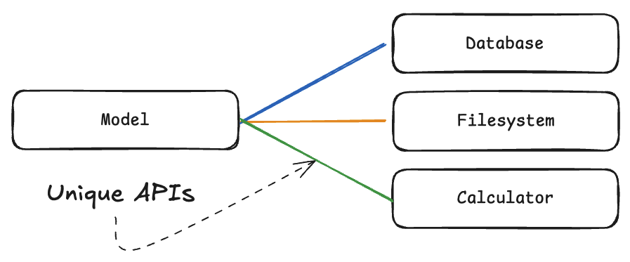
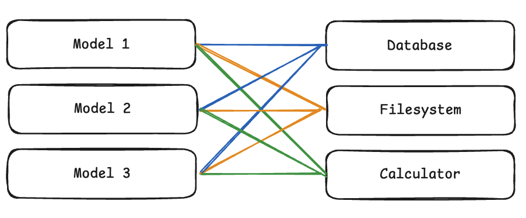
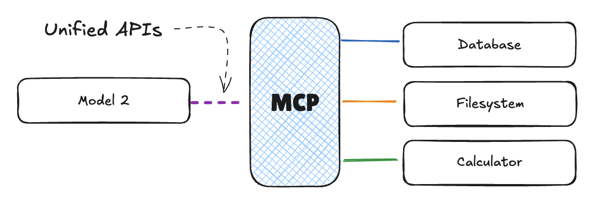
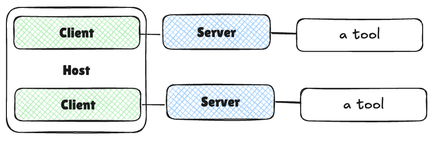
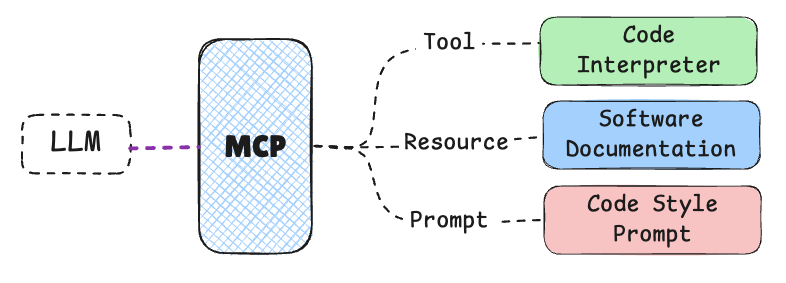
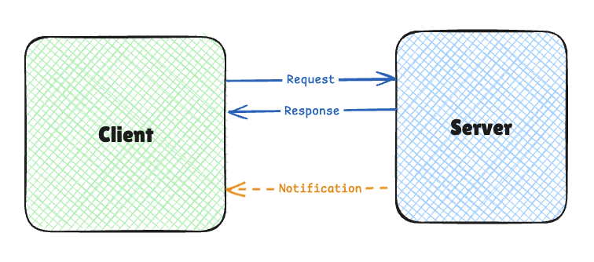
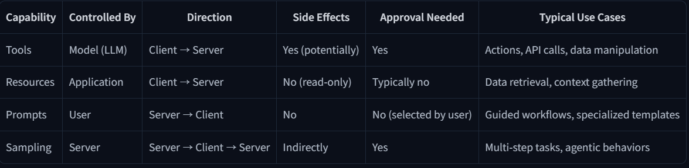
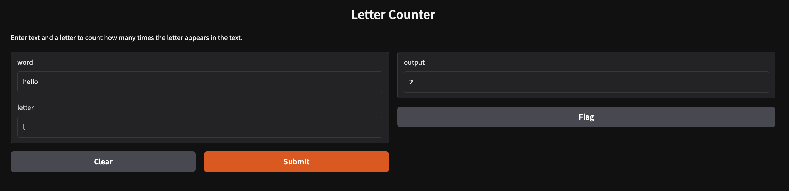

# Unit 1

---

---

# What I will learn

In this unit, you will:

- Understand what Model Context Protocol is and why it’s important
- Learn the key concepts and terminology associated with MCP
- Explore the integration challenges that MCP solves
- Walk through the key benefits and goals of MCP
- See a simple example of MCP integration in action

By the end of this unit, you’ll have a solid understanding of the foundational concepts of MCP and be ready to dive deeper into its architecture and implementation in the next unit.

---

# Overview of Unit 1

1. **What is Model Context Protocol?** - We’ll start by defining what MCP is and discussing its role in the AI ecosystem.
2. **Key Concepts** - We’ll explore the fundamental concepts and terminology associated with MCP.
3. **Integration Challenges** - We’ll examine the problems that MCP aims to solve, particularly the “M×N Integration Problem.”
4. **Benefits and Goals** - We’ll discuss the key benefits and goals of MCP, including standardization, enhanced AI capabilities, and interoperability.
5. **Simple Example** - Finally, we’ll walk through a simple example of MCP integration to see how it works in practice.

---

# Key Concepts and Terminology

MCP를 보통 “AI를 위한 애플리케이션 USB-C” 로 설명합니다. USB-C가 여러 장치를 컴퓨팅 장치에 연결하기 위한 표준화된 인터페이스를 제공하는것처럼 MCP는 외부 기능을 AI 모델에게 연결하기 위한 일관된 프로토콜입니다.

1. MCP를 통해 유저는 AI 애플리케이션에서 더 간단하고, 일관화 된 경험을 즐길 수 있다.
2. AI application 개발자는 에코시스템에 ai를 위한 도구나 데이터 소스를 더 쉽게 추가할 수 있다.
3. tool 이나 데이터 공급자는 각각의 전송하기 위한 구현을 하는게 아니라 MCP를 이용한 단일 구현만 하면 된다.

## 통합 문제(Integration Problem)

여기서 통합문제는 M개의 다른 AI 를 N개의 외부 도구(데이터 소스)와 연결하는 문제를 말한다.



https://huggingface.co/datasets/mcp-course/images/resolve/main/unit1/1.png

여기서는 MCP가 있을 때와 없을 때를 비교로 둘 수 있다.

- MCP가 없을 때
    - 여러 모델과 여러 도구가 있으면 통합의 수가 너무 많기에 관리하기가 어렵다 왜냐하면 각각의 모델은 unique 인터페이스를 가지기 때문이다. 그렇기에 M * N이 된다.
    
    
    
    [https://huggingface.co/datasets/mcp-course/images/resolve/main/unit1/1a.png](https://huggingface.co/datasets/mcp-course/images/resolve/main/unit1/1a.png)
    

- MCP를 이용할 때
    - 하지만 MCP를 이용할 때는 MCP가 일관된 인터페이스를 제공하기에 AI 모델 들은 MCP의 클라이언트를 한번만 구현하는 것을 통해 여러 도구를 이용할 수 있다. 그렇기에 여러 도구가 들어간 MCP를 한번 연결하는것으로  그 도구들을 이용할 수 있기에 M + N이 된다.
    
    
    
    [https://huggingface.co/datasets/mcp-course/images/resolve/main/unit1/2.png](https://huggingface.co/datasets/mcp-course/images/resolve/main/unit1/2.png)
    

## MCP terminology

MCP를 구성하는 용어들을 알아보자.

MCP의 용어로는 components, capabilities 들이 있다.

- Components
    
    
    
    [https://huggingface.co/datasets/mcp-course/images/resolve/main/unit1/3.png](https://huggingface.co/datasets/mcp-course/images/resolve/main/unit1/3.png)
    
    - HTTP 프로토콜에서의 서버와 클라이언트의 관계처럼 MCP도 서버와 클라이언트를 가지고 있다.
        - Host : 유저가 직접적으로 상호작용하는 AI 애플리케이션이다. 예를 들어 클로드 데스크탑, AI IDE (cursor, copoilot..)등이 있다. 호스트는 MCP 서버들과의 연결을 담당하고 mcp가 이용되는 AI 처리, 요청, 도구 호출의 전체적인 흐름을 조절한다.
        - Client : 호스트의 구성 요소로 MCP 와 통신을 하는 부분을 담당한다.
        - Server : MCP를 위한 기능들을 노출하는 프로그램이나 서비스이다.



[https://huggingface.co/datasets/mcp-course/images/resolve/main/unit1/4.png](https://huggingface.co/datasets/mcp-course/images/resolve/main/unit1/4.png)

위 이미지를 통해 좀 더 구체화해서 이해할 수 있다.

- Capabilities
    - 애플리케이션이 “무엇”을 할 수 있느냐에 따라 가치가 있는 애플리케이션이 될 수 있는 것처럼, MCP 또한 이러한 기능이 중요하다.
    - 여기 있는 테이블은 예시로 code agent를 MCP를 가정했을 때 볼 수 있는 기능들의 예시다.
        
        
        
        [https://huggingface.co/datasets/mcp-course/images/resolve/main/unit1/8.png](https://huggingface.co/datasets/mcp-course/images/resolve/main/unit1/8.png)
        
        | Capability | Description | Example |
        | --- | --- | --- |
        | Tools | Executable functions that the AI model can invoke to perform actions or retrieve computed data. Typically relating to the use case of the application. | A tool for a weather application might be a function that returns the weather in a specific location. |
        | Resources | Read-only data sources that provide context without significant computation. | A researcher assistant might have a resource for scientific papers. |
        | Prompts | Pre-defined templates or workflows that guide interactions between users, AI models, and the available capabilities. | A summarization prompt. |
        | Sampling | Server-initiated requests for the Client/Host to perform LLM interactions, enabling recursive actions where the LLM can review generated content and make further decisions. | A writing application reviewing its own output and decides to refine it further. |
    - 위의 예시로 들은 code agent 의 mcp entities를 아래처럼 가져갈 수 있다.
        
        
        | Entity | Name | Description |
        | --- | --- | --- |
        | Tool | Code interpreter | A tool that can execute code that the LLM writes. |
        | Resources | Documentation | A resource that contains the documentation of the application. |
        | Prompt | Code style | A prompt that guides the LLM to generate code. |
        | Sampling | Code review | A sampling that allows the LLM to review the code and make further decisions. |

---

# Architectureal components of MCP

좀 더 깊게 MCP의 구성요소들의 설계적인 부분들을 보자면 앞서 말했던 MCP의 구성요소가 있다. 그리고 의사소통 흐름 그러니까 Communication Flow가 있다.

## Communication Flow

MCP의 통신 흐름은 아래와 같이 흘러 간다 할 수 있다.

1. User Interact: 유저가 호스트 애플리케이션과 원하는 바를 표현하며 상호 작용한다.
2. Host Processing: 호스트가 유저의 인풋을 LLM이 요청을 이해 할 수 있도록 처리하고 어떤 기능이 필요한지 결정한다.
3. Client Connection: 호스트가 적절한 서버로 클라이언트를 연결한다.
4. Capability Discovery: 클라이언트가 서버로 서버가 어떤 기능들을 제공하는지 쿼리를 통신한다.
5. Capability Invocation: 유저의 요청 사항에 따라 LLM의 결정 아래에 서버로 부터 적절한 기능을 클라이언트로 호출하도록 한다.
6. Server Execution: 서버는 그럼 요청된 기능을 호출하여 실행 후 결과값을 클라이언트에게 통신한다.
7. Result Integration: 통신을 받은 클라이언트는 호스트에게 결과값을 릴레이한다. 그 후 호스트는 값을 LLM을 위한 컨텍스트 또는 유저를 위한 아웃풋에 값을 통합한다. 

이러한 아키텍처 구조의 장점은 모듈성이다. 1개의 호스트가 여러 클라이언트를 통해  여러 서버에 동시에 연결 할 수 있게 된다. 그리고 새로운 서버를 추가할려고 할 경우에도 에코 시스템에 변경 없이 손 쉽게 통합할 수 있다는 것이다.

결론적으로는 아키텍처는 단순하지만, 프로토콜의 표준화와 구성 요소 간의 명확한 책임 분담적인 모듈성에 있다. 이러한 설계 구조 덕분에 AI 모델이 계속 늘어나는 외부 도구 또는 데이터 소스와 원할하게 연결 될 수 있는 응집적인 에코시스템을 구축 할 수 있다는 것이다.

---

# Communication Protocol



[https://huggingface.co/datasets/mcp-course/images/resolve/main/unit1/5.png](https://huggingface.co/datasets/mcp-course/images/resolve/main/unit1/5.png)

MCP는 JSON-RPC 2.0을 메시지 포맷으로 사용한다. 이 JSON-PRC 2.0은 가벼운 원격 통신  규격으로 json으로 인코딩되어있다. 그리고 프로토콜은 3가지 종류의 메시지로 나뉜다.

1. Requests
2. Responses
3. Notifications

## Requests

클라이언트→ 서버로 보내지는 작동을 초기화하는 메시지이다.

요청 메시지는 unique identifier(ID), method 의 이름, 그리고 method가 필요한 인자가 있다면 인자들을  가진다.

예시)

```python
{
  "jsonrpc": "2.0",
  "id": 1,
  "method": "tools/call",
  "params": {
    "name": "weather",
    "arguments": {
      "location": "San Francisco"
    }
  }
}
```

## Responses

서버 → 클라이언트로 보내지는 응답 메시지이다. 

응답은 마찬가지로 같은 ID 와 결과 값 또는 에러를 포함한다.

- 정상 결과
    
    ```python
    {
      "jsonrpc": "2.0",
      "id": 1,
      "result": {
        "temperature": 62,
        "conditions": "Partly cloudy"
      }
    }
    ```
    
- 실패 결과
    
    ```python
    {
      "jsonrpc": "2.0",
      "id": 1,
      "error": {
        "code": -32602,
        "message": "Invalid location parameter"
      }
    }
    ```
    

## Notification

단반향 메시지으로써 응답 메세지를 요구하지 않는다. 보통 서버 → 클라이언트로 보내지며 이벤트의 업데이트나 알림의 내용을 포함한다.

```python
{
  "jsonrpc": "2.0",
  "method": "progress",
  "params": {
    "message": "Processing data...",
    "percent": 50
  }
}
```

---

# Transport Mechanisms

통신 매커니즘에는 2가지 방식을 이용할 수 있는데, stdio(standard Input/Output) 와 HTTP + SSE (Server-Sent Events) / Streamable HTTP 로 나뉜다.

- stdio
    - 로컬 통신을 위해 쓰인다. 클라이언트와 서버가 같은 머신 위에 있을 때 쓴다.
    - 호스트 애플리케이션이 서버를 subprocess로 실행하고 stdio를 통해 통신을 하는 것이다.
    - 이 방식은 쉽고, 네트워크가 요구 되지 않고, 보안화된 통신을 할 수 있다는 것이다.

- HTTP + SSE
    - 원격 통신을 위해 쓰인다. 클라이언트와 서버가 서로 다른 머신 위에 있을 때 쓴다.
    - 통신은 HTTP 위에서 작동하며, SSE를 통해 서버의 업데이트를 클라이언트에 지속적인 연결을 제공한다.
    - 이 방식은 네트워크를 이용하기에 웹 서비스들과 통합할 수 있다는 것 그리고 서버리스 환경과 호환한다는 것이다.

---

# Understanding MCP Capabilities

MCP의 기능으로는 Tools, Resources, Prompts, Sampling을 앞서 이야기 되었다.

이 부분에서는 이 기능들에 대해서 좀 더 자세히 예시를 든다.

- Tools
    - 실행 가능한 기능이나 동작으로  AI가 MCP 프로토콜을 통해 실행되는 것
    - 실행 : 유저의 요청이나 context에 의해 AI으로부터 실행된다.
    - 안전 : 부작용을 낳을 수 있는 동작들을 실행하기 때문에, 위험할 수 있다. 그렇기에 유저에게서 허가를 받는것이 필요 하다.
    - use cases : Sending messages, creating tickets, querying APIs, performing calculations.
    
    ```python
    # Example: A weather tool that fetches current weather data for a given location
    def get_weather(location: str) -> dict:
        """Get the current weather for a specified location."""
        # Connect to weather API and fetch data
        return {
            "temperature": 72,
            "conditions": "Sunny",
            "humidity": 45
        }
    ```
    

- Resources
    - AI 모델이 복잡한 logic 없이 문맥을 위한 데이터 소스를 오직 읽기-전용으로 접속할 수 있도록 제공한다.
    - 실행 : application-controlled 이며, 보통 host application 가 접속 허용 여부를 결정한다.
    - 성격 :  이 기능은 데이터를 최소한의 컴퓨팅 자원으로 가져오도록 설계되었다. REST APIs에서 GET endpoint와 비슷하다.
    - 안전 : 오직 읽기-전용이기에, 도구 보다는 낮은 안전성이 요구된다.
    - use cases : Accessing file contents, retrieving database records, reading configuration information.
    
    ```python
    # Example: A resource that provides access to file contents
    def read_file(file_path: str) -> str:
        """Read the contents of a file at the specified path."""
        with open(file_path, 'r') as f:
            return f.read()
    ```
    

- Prompts
    - 프롬프트는 서버의 기능들이나, AI 모델, 그리고 유저의 사이에서 상호 작용하는 workflow나 템플릿을 미리 정의 해놓은것을 말한다.
    - 실행 : prompt 는 user-controlled 로 host application의 UI 로 표기된다.
    - 목적 : 최적화된 tools & resources를 사용하기 위한 구조로 쓰인다
    - 선택 : Users 가 AI 모델이 작동하기 전에 보통 문맥을 설정하기 위해 선택된다.
    - use cases :  Common workflows, specialized task templates, guided interactions.
    
    ```python
    # Example: A prompt template for generating a code review
    def code_review(code: str, language: str) -> list:
        """Generate a code review for the provided code snippet."""
        return [
            {
                "role": "system",
                "content": f"You are a code reviewer examining {language} code. Provide a detailed review highlighting best practices, potential issues, and suggestions for improvement."
            },
            {
                "role": "user",
                "content": f"Please review this {language} code:\n\n```{language}\n{code}\n```"
            }
        ]
    ```
    

- Sampling
    - 서버가 클라이언트 정확히는 호스트에게 요청을 통해 LLM 과 상호 작용하도록 허가하는 것이다.
    - 샘플링은 server-initiated 하지만 client/server의 작동 또한 요구 된다.
    - 목적 : server-driven 에이전틱한 행동과 잠재적이며 반복적인 또는 multi-step 상호 작용을 할 수 있다.
    - 안전 :  Tools와 같이, sampling 도 유저의 허가가 필요하다.
    - uses cases : Complex multi-step tasks, autonomous agent workflows, interactive processes
    
    ```python
    # A Server might request the Client to analyze data it has processed
    def request_sampling(messages, system_prompt=None, include_context="none"):
        """Request LLM sampling from the client."""
        # In a real implementation, this would send a request to the client
        return {
            "role": "assistant",
            "content": "Analysis of the provided data..."
        }
    ```
    

- The sampling flow follows these steps:
    1. Server sends a `sampling/createMessage` request to the client
    2. Client reviews the request and can modify it
    3. Client samples from an LLM
    4. Client reviews the completion
    5. Client returns the result to the server

> 추가적인 팁
This human-in-the-loop design ensures users maintain control over what the LLM sees and generates. When implementing sampling, it’s important to provide clear, well-structured prompts and include relevant context.
> 

기능을 정리하자면 아래로 표현할 수 있다.



---

# MCP SDK

MCP는 Sofeware Development Kit을 JavaScript, Python 등 여러 언어로 지원한다.

이 SDK는 MCP를 “나의 애플리케이션”에 구현하는데 더 쉽게 할 수 있도록 돕는다. 그렇기에 MCP의 기능만 집중할 수 있게 된다.

- SDK 로는 아래의 기능들을 지원한다:
    - Protocol-level communication
    - Capability registration and discovery
    - Message serialization/deserialization
    - Connection management
    - Error handling

- SDK를 이용한 MCP 작성 예시

```python
# server.py
from mcp.server.fastmcp import FastMCP

# Create an MCP server
mcp = FastMCP("Weather Service")

# Tool implementation
@mcp.tool()
def get_weather(location: str) -> str:
    """Get the current weather for a specified location."""
    return f"Weather in {location}: Sunny, 72°F"

# Resource implementation
@mcp.resource("weather://{location}")
def weather_resource(location: str) -> str:
    """Provide weather data as a resource."""
    return f"Weather data for {location}: Sunny, 72°F"

# Prompt implementation
@mcp.prompt()
def weather_report(location: str) -> str:
    """Create a weather report prompt."""
    return f"""You are a weather reporter. Weather report for {location}?"""

# Run the server
if __name__ == "__main__":
    mcp.run()
```

- command line에서 아래와 같이 쓰면 서버에 접속 할 수 있게 된다.

```python
mcp dev server.py

Starting MCP inspector...
⚙️ Proxy server listening on port 6277
Spawned stdio transport
Connected MCP client to backing server transport
Created web app transport
Set up MCP proxy
🔍 MCP Inspector is up and running at http://127.0.0.1:6274 🚀
```


---

# MCP Clients

MCP 클라이언트는 AI 애플리케이션(호스트)과 MCP 서버에서 제공하는 외부 기능 간의 다리 역할을 하는 중요한 구성 요소다.

클라이언트에는 대게 3가지 종류가 있다.

1. User interface client
2. Chat interface clinet : Antrophic’s claude desktop 같은 앱등이 있다.
3. Interactive devlopment client : Cursor 같은 AI IDE에서 쓸 수 있다.

- Configure MCP clients

MCP 서버 및 클라이언트를 구성하는 방법을 살펴보겠습니다.

MCP 호스트는 configure file을 사용하여 서버 연결을 관리한다. 즉, 사용 가능한 서버 확인 및 서버에 연결하는 방법을 정의한다. 또한 이 파일은 여러 host에서도 일관되게 사용할 수 있다.

- mcp.json의 구조

```python
{
  "servers": [
    {
      "name": "Server Name",
      "transport": {
        "type": "stdio|sse",
        // Transport-specific configuration
      }
    }
  ]
}
```

- stdio transport 에 대한 구성 예시

```python
{
  "servers": [
    {
      "name": "File Explorer",
      "transport": {
        "type": "stdio",
        "command": "python",
        "args": ["/path/to/file_explorer_server.py"] // This is an example, we'll use a real server in the next unit
      }
    }
  ]
}
```

→ stdio 에 준 뒤 args를 통해 필요한 명령과 인자들을 지정할 수 있다.

- HTTP+SSE transport에 대한 구성 예시

```python
{
  "servers": [
    {
      "name": "Remote API Server",
      "transport": {
        "type": "sse",
        "url": "https://example.com/mcp-server"
      }
    }
  ]
}
```

→ 원격 서버의 경우 서버의 URL이 포함된다.

- 토큰이 필요시 구성 예시

```python
{
  "servers": [
    {
      "name": "GitHub API",
      "transport": {
        "type": "stdio",
        "command": "python",
        "args": ["/path/to/github_server.py"], // This is an example, we'll use a real server in the next unit
        "env": {
          "GITHUB_TOKEN": "your_github_token"
        }
      }
    }
  ]
}
```

---

# Gradio MCP integration

그라디오를 통해 MCP server를 빠르게 통합할 수 있다.

이 그라디오는 빠르게 데모와 프로토타입, 모델를 비개발자와 공유할 때, 그리고 테스트 와 디버깅하기 위할 때 좋다.

- 사전 필요

```python
pip install "gradio[mcp]"
```

- Creating MCP server with Gradio

```python
import gradio as gr

def letter_counter(word: str, letter: str) -> int:
    """
    Count the number of occurrences of a letter in a word or text.

    Args:
        word (str): The input text to search through
        letter (str): The letter to search for

    Returns:
        int: The number of times the letter appears in the text
    """
    word = word.lower()
    letter = letter.lower()
    count = word.count(letter)
    return count

# Create a standard Gradio interface
demo = gr.Interface(
    fn=letter_counter,
    inputs=["textbox", "textbox"],
    outputs="number",
    title="Letter Counter",
    description="Enter text and a letter to count how many times the letter appears in the text."
)

# Launch both the Gradio web interface and the MCP server
if __name__ == "__main__":
    demo.launch(mcp_server=True)
```

- When you set `mcp_server=True` in `launch()`, several things happen:
    1. Gradio functions are automatically converted to MCP Tools
    2. Input components map to tool argument schemas
    3. Output components determine the response format
    4. The Gradio server now also listens for MCP protocol messages
    5. JSON-RPC over HTTP+SSE is set up for client-server communication

- 서버를 아래처럼 볼 수 있게 되고 화면은 사진처럼 나온다.

```python
http://your-server:port/gradio_api/mcp/sse
```



- Trouble shooting tip
    1. Type Hints and Docstring : ensure providing type hints and valid docstring for functions. the docstring should include an “Args:” block with indented parameter names.
    2. String inputs : accept input arguments as “str” and convert them to the desired type inside the function.
    3. SSE support : Some MCP don’t support SSE-based MCP servers.  In those case, can use “mcp-remote”
        
        ```python
        {
          "mcpServers": {
            "gradio": {
              "command": "npx",
              "args": [
                "mcp-remote",
                "http://your-server:port/gradio_api/mcp/sse"
              ]
            }
          }
        }
        ```
        
    4. Restart : If you encounter connection issues, try restarting both MCP client and server.

---