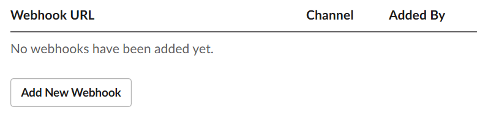

# Unit3

---

---

이번 unit3에서는 Claude Code을 위한 MCP server를 구축해본다.

# What you will learn

PR Agent workflow server를 만들어본다. 

- Smart PR Management : Automatic PR template selection based on code changes using MCP tool
- CI/CD Monitoring : Track GitHub actions with cloudflare tunnel and standardized prompts
- Team Communication : slack notifications demonstrating all mcp primitives working together

이 PR Agent를 만드는 이유는 실제 현업에서 직면하는 번거로운 문제 중 하나이기 때문이다.

**Before**: Developer manually creates PRs, waits for Actions to complete, manually checks results, remembers to notify team members

**After**: Claude Code connected to your workflow server can intelligently:

- Suggest the right PR template based on changed files
- Monitor GitHub Actions runs and provide formatted summaries
- Automatically notify team via Slack when deployments succeed/fail
- Guide developers through team-specific review processes based on Actions results

---

## Module 1: Build MCP server

**MCP 서버 구축 튜토리얼 - PR 에이전트 만들기**

1. **Pull Request 분석 에이전트를 만드는 MCP 서버 구축 튜토리얼**이며, git 변경사항을 분석해서 의미 있는 PR 설명을 자동 생성하는 도구를 개발합니다.
2. **세 가지 핵심 도구를 구현**합니다: `analyze_file_changes` (git diff 분석), `get_pr_templates` (템플릿 관리), `suggest_template` (적절한 템플릿 추천)
3. **MCP 철학**을 배웁니다 - 복잡한 로직을 하드코딩하는 대신 Claude에게 원시 데이터를 제공하고 지능적인 판단을 맡기는 방식으로 유연하고 효과적인 도구를 만듭니다.

Claude Code 에 mcp 로 연결하기

```python
# Add the MCP server to Claude Code
claude mcp add pr-agent -- uv --directory /absolute/path/to/starter run server.py

# Verify the server is configured
claude mcp list
```

---

## Module 2: GitHub Actions

**GitHub Actions 통합 - 실시간 CI/CD 모니터링**

1. **Module 1의 PR 에이전트에 실시간 webhook 기능을 추가**하여 GitHub Actions 이벤트를 실시간으로 모니터링하고, CI/CD 파이프라인의 실패를 즉시 감지할 수 있는 시스템을 구축합니다.
2. **MCP Prompts라는 새로운 개념을 도입**하여 워크플로우 가이드를 제공하며, webhook 서버와 MCP 서버를 동시에 운영해서 GitHub 이벤트를 수신하고 분석하는 도구들을 구현합니다.
3. **Cloudflare Tunnel을 사용한 로컬 테스팅 환경**을 구축하고, 코드 변경사항 분석(Module 1)과 실시간 CI/CD 모니터링(Module 2)을 결합하여 포괄적인 개발 모니터링 시스템을 완성합니다.

- Get Started
    1. MCP [server.py](http://server.py) 실행
        
        ```python
        python /path to file/server.py
        ```
        
    2. Webhook 설정
        - 상세 코드
            
            ```python
            #!/usr/bin/env python3
            """
            Simple webhook server for GitHub Actions events.
            Stores events in a JSON file that the MCP server can read.
            """
            
            import json
            from datetime import datetime
            from pathlib import Path
            from aiohttp import web
            
            # File to store events
            EVENTS_FILE = Path(__file__).parent / "github_events.json"
            
            async def handle_webhook(request):
                """Handle incoming GitHub webhook"""
                try:
                    data = await request.json()
                    
                    # Create event record
                    event = {
                        "timestamp": datetime.utcnow().isoformat(),
                        "event_type": request.headers.get("X-GitHub-Event", "unknown"),
                        "action": data.get("action"),
                        "workflow_run": data.get("workflow_run"),
                        "check_run": data.get("check_run"),
                        "repository": data.get("repository", {}).get("full_name"),
                        "sender": data.get("sender", {}).get("login")
                    }
                    
                    # Load existing events
                    events = []
                    if EVENTS_FILE.exists():
                        with open(EVENTS_FILE, 'r') as f:
                            events = json.load(f)
                    
                    # Add new event and keep last 100
                    events.append(event)
                    events = events[-100:]
                    
                    # Save events
                    with open(EVENTS_FILE, 'w') as f:
                        json.dump(events, f, indent=2)
                    
                    return web.json_response({"status": "received"})
                except Exception as e:
                    return web.json_response({"error": str(e)}, status=400)
            
            # Create app and add route
            app = web.Application()
            app.router.add_post('/webhook/github', handle_webhook)
            
            if __name__ == '__main__':
                print("🚀 Starting webhook server on http://localhost:8080")
                print("📝 Events will be saved to:", EVENTS_FILE)
                print("🔗 Webhook URL: http://localhost:8080/webhook/github")
                web.run_app(app, host='localhost', port=8080)
            ```
            
    3. cloudflared tunneling
        
        ```python
        cloudflared tunnel --url http://localhost:8080
        ```
        
    4. git hub repository의 setting에서 web hook 설정
        - 나온 웹 url을 복사한다
        - repository의 setting으로 이동한다
        - Webhooks로 들어간다
        - “Add webhook”을 한다
            - payloaded URL 안에 링크 url을 넣어준다.
            - content type 은 `application/json` 으로 한다.
            - 나머지 어떤 내용을 보낼 것인지 설정 한다. (Send me everything. 추천)
    5. git hub의 push와 pr을 열고 테스트한다.

---

## Module 3: Slack Notification

**Slack 알림 통합 - 팀 커뮤니케이션 자동화 완성**

1. **Module 1,2에서 구축한 PR 에이전트와 CI/CD 모니터링 시스템에 Slack 웹훅 통합을 추가**하여, GitHub Actions 이벤트를 실시간으로 팀 채널에 자동 알림하는 완전한 개발 자동화 시스템을 완성합니다.
2. **Slack API 앱 생성, send_slack_notification 도구 구현, CI 실패/성공 알림을 위한 MCP Prompts 추가**를 통해 Tools와 Prompts가 함께 작동하는 고급 MCP 패턴을 학습합니다.
3. **정보 사일로 문제를 해결**하여 팀원들이 이미 해결된 문제에 시간을 낭비하거나 준비된 자산을 놓치는 일 없이, GitHub → 로컬 저장소 → Claude 분석 → Slack 알림으로 이어지는 완전한 워크플로우를 구축합니다.

- 사전 조건
    - slack webhook  만들기
        - https://api.slack.com/apps 을 통해 이름과 workspace를 정하기
        - “features’로 가기 → “incoming webhooks”
        - ON 으로 옵션을 바꾼뒤 아래의 사진의 Webhook 추가를 한다.
            
            
            
        - 이제 만들어진 webhook 주소로 RESTAPI  test 해 볼 수 있다.
            
            ```python
            curl -X POST -H 'Content-type: application/json' \
              --data '{"text":"Hello from MCP Course!"}' \
              YOUR_WEBHOOK_URL
            ```
            

- Get started
    - module 2와 마찬가지로 같은 flow의 실행을 따르면 된다.
    - 하지만 slack으로 알림이 가는지가 중요하다.

---

# 추가 지식

`FastMCP` 을 쓸 때 쓰이는  `@mcp` 데코레이터의 종류에는 3가지가 있다.

1. @mcp.tool() - 도구/함수 정의 ⇒ POST 엔드포인트와 유사
    - 예시
    
    ```python
    @mcp.tool()
    async def search_files(query: str, limit: int = 10) -> list[dict]:
        """파일을 검색합니다."""
        # 실제 동작을 수행하고 결과 반환
        return results
    
    # 매개변수 설정 예시
    @mcp.tool(
        annotations=ToolAnnotations(
            readOnlyHint=True,     # 읽기 전용 힌트
            idempotentHint=True,   # 멱등성 힌트
            openWorldHint=True     # 외부 시스템과 상호작용 힌트
        )
    )
    def calculate_something(data: str) -> dict:
        """계산을 수행합니다."""
        return result
    ```
    
2. @mcp.resource() - 리소스 정의 ⇒ GET 엔드포인트와 유사
    - 예시
    
    ```python
    # 정적 리소스
    @mcp.resource("config://settings")
    def get_config() -> dict:
        """설정 정보를 반환합니다."""
        return {"version": "1.0", "debug": True}
    
    # 동적 리소스 (URI 템플릿 사용)
    @mcp.resource("user://{user_id}/profile")
    def get_user_profile(user_id: int) -> dict:
        """사용자 프로필을 반환합니다."""
        return {"id": user_id, "name": f"User {user_id}"}
    
    # 상세 매개변수 설정
    @mcp.resource(
        uri="data://app-status",
        name="Application Status",
        description="애플리케이션 상태 정보",
        mime_type="application/json",
        tags={"monitoring", "status"},
        enabled=True  # 기본값은 True
    )
    def get_app_status() -> dict:
        return {"status": "running", "uptime": 12345}
    ```
    
3. @mcp.prompt() - 프롬프트 템플릿 정의
    - 예시
    
    ```python
    @mcp.prompt()
    def code_review_prompt(code: str) -> str:
        """코드 리뷰를 위한 프롬프트를 생성합니다."""
        return f"다음 코드를 리뷰해주세요:\n\n```python\n{code}\n```"
    
    # 메시지 객체를 사용한 복잡한 프롬프트
    from fastmcp.prompts.base import UserMessage, AssistantMessage
    
    @mcp.prompt()
    def debug_session(error: str) -> list[Message]:
        """디버깅 세션을 시작하는 프롬프트입니다."""
        return [
            UserMessage(f"이런 에러가 발생했습니다:\n{error}"),
            AssistantMessage("도움을 드릴 수 있습니다. 전체 스택트레이스와 시도한 내용을 알려주세요.")
        ]
    ```